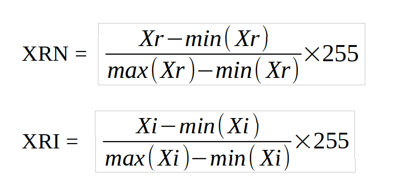

# Shaposhnik Vladislav create README.md

Resumen
Este trabajo tiene como objetivo indagar en la conversión de archivos de audio en imágenes equivalentes en formato JPG. Esta técnica ese basa en obtener imágenes de un archivo audio WAV, buscando reducir el espacio ocupado por los datos del audio original, basándose en la compresión usual de audio a formatos como MP3. Se hace uso para ello de la Transformada Rápida de Fourier y la transformada de Wavelet (para la reducción de ruido).

Abstract
The objective of this work is to investigate the transmission of audio files in equivalent images in JPG format. This technique is based on obtaining images from a WAV audio file, seeking to reduce the space occupied by the original audio data, based on the usual compression of audio to formats such as MP3. It makes use of the Fast Fourier Transform and the Wavelet transform (for the reduction of white noise).

Palabras Clave: JPG, WAV, Wavelet, fft, Python, Imágenes equivalentes.
Tema: Ciencias de la Computación, Compresión de Audio, Matemática Numérica.

## Introducción
Actualmente, existen varias técnicas para comprimir archivos de audio, pudiendo destacar la del formato MP3, que buscan reducir el tamaño del archivo tratando de mantener cierta calidad del sonido aunque es importante destacar que en cualquier procesamiento digital de señales de audio, existe pérdida de la señal original, o adición de ruido.

Estas técnicas de compresión requieren dos algoritmos, uno para comprimir los archivos en la fuente y otro para descomprimirlos en el destino, también conocidos como codificadores y decodificadores, respectivamente.

El algoritmo empleado en este proyecto, consiste en codificar la señal de audio en la fuente y transmitirla al destino de forma que este pueda decodificarla adecuadamente y luego “limpiar” el ruido de la señal como una de las aplicaciones de las transformadas de Wavelets.

## Preliminares
Para la realización del algoritmo se utilizará un archivo de audio o voz en formato WAV que es un formato sin ningún tipo de compresión de datos. Esta técnica es poco investigada, encontrando la información reunida solo en el artículo [1].

## Propuesta
Nuestra propuesta consiste en establecer la transferencia de los datos del audio del transmisor hacia el receptor a través de imágenes, la señal se recuperará en este último y le será aplicado un filtro para quitar los daños que se puedan haber adicionado a la señal original debido a los procesos intermedios.

### Transmisor
Se guarda los datos de la señal de audio en un vector al cual se le aplica el algoritmo de la transformada rápida de Fourier FFT. De esta manera se obtienen N muestras complejas conjugadas. Para los propósitos de transmisión basta con procesar la mitad de esas N muestras. Si se toma solo una muestra de cada par conjugado, se podrá predecir el otro par cuando se esté recuperando la señal en el decodificador. De estas N/2 muestras se separan la parte real e imaginaria para tratarlas por separado en la obtención de las imágenes equivalentes, para lo cual se transforman los datos normalizándolos para obtener una imagen en escala de grises. Esto requiere que se utilice el tipo de datos entero sin signo,y para ello especificamos el cambio en Python usando astype(np.uint8).

La técnica que se usa es la normalización de las muestras a valores dentro del rango de 0 a 255. Para lograrlo se deben obtener los valores máximos y mínimos de las muestras tanto para la parte real como para la parte imaginaria. Se exponen las fórmulas para la normalización en 1 y 2. La parte imaginaria se deberá normalizar de la misma manera.

XRN: Es el vector que representa la parte real del espectro de
la señal de audio convertido a una imagen con valores desde 0
a 255.

XRI: Es el vector que representa la parte imaginaria del
espectro de la señal de audio convertido a una imagen con
valores desde 0 a 255.

Xr: Es la parte real del vector que representa el espectro de la
señal de audio

Xi: Es la parte imaginaria del vector que representa el espectro
de la señal de audio.

Una vez que tenemos las imágenes equivalentes de la parte real y la parte imaginaria se aplica la compresión de imágenes a tipo JPG.

### Receptor
Una vez que en el receptor se reciben las imágenes equivalentes, primeramente las descomprimimos y obtenemos sus píxeles.

Estos píxeles son los que debemos desnormalizar valiéndonos de los valores máximos y mínimos incluidos en las imágenes. Para ello debemos cambiar el tipo de dato de entero sin signo a tipo double el cual proporciona las magnitudes más grandes y más pequeñas posibles para un número. Se muestra en 3 y 4 la fórmula para la desnormalización.

Una vez desnormalizada tanto la parte real como la parte imaginaria las unimos para obtener las muestras complejas (a + jb) y completamos las N/2 muestras restantes construyendo sus pares conjugados (a - jb). Luego aplicamos la transformada inversa de Fourier utilizando el algoritmo de la transformada rápida de Fourier inversa (IFFT). La señal recuperada no será exactamente igual a la original ya que proviene de un proceso de compresión de imágenes que aporta pérdidas. Para resolver este inconveniente, en el receptor hemos incorporado un filtro wavelet para reducción de ruido. Esto lo logramos a través de la función wavedec, incluida en la librería PyWavelet, a la que le especificamos como función ‘db3’, correspondiente a Daubechies de orden 3.

## Resultados
Como resultado tenemos la implementación del algoritmo descrito, que acciona con aun audio en formato WAV. El mismo cuenta con un codificador (transmisor) que convierte los datos a dos imágenes (“real.jpg” y “imag.jpg”) y un decodificador (receptor) que trabaja con estas imágenes recuperando el archivo de audio siguiendo lo explicado anteriormente.

Si analizamos el tamaño de los archivos en los que estamos almacenando la información de la señal ahora, podemos ver que es mucho menor que el audio en cuestión , y si lo comparamos con la compresión usual de los archivos de sonido a formatos como MP3, podemos notar que esta técnica aun supera en ahorro de almacenamiento a cualquiera de estas opciones.

Sin embargo, dado que la referencias encontradas que abordan este tema trabajan con otro Software (Matlab) y la función sugerida para la eliminación del ruido al recuperar el audio en el receptor no tiene una función análoga en Python, las señales recuperadas no tienen la calidad que se esperaba con la realización de esta investigación.

## Conclusiones
 Podemos concluir entonces, que siguen obteniéndose mejores resultados en cuanto a la calidad del sondo si lo comprimimos a los formatos como MP3, aunque dado que la técnica explicada e implementada en este proyecto pudiera ser perfeccionada con más investigación al respecto, o quizás utilizando otro Software que proporcione más opciones se puedan obtener mejores resultados buscando siempre que nuestros datos ocupen el menor tamaño posible.

## Agradecimientos
Agradecer primeramente a las tutoras; también a Daniel Barzola y a Damián Valdés Santiago.

## Referencias
[1]  Daniel Barzola, Roberto Cabrera, Ing. Patricia Chávez, Ing. Juan Carlos AvilésPatrick W. Daly. COMPARACIÓN ENTRE COMPRESIÓN DE AUDIO EN
DIFERENTES FORMATOS DE IMÁGENES EQUIVALENTES Y
EL FORMATO DE COMPRESIÓN MP3, 2014. 

[2] Gonzáles, Woods - Digital Image Processing (Prentice Hall 3ed 2008) Best copy.

[3]  Rafael C. Gonzalez, Richard E. Woods, Steven L. Eddins-Digital Image Processing Using MATLAB-Gatesmark Publishing (2009)
